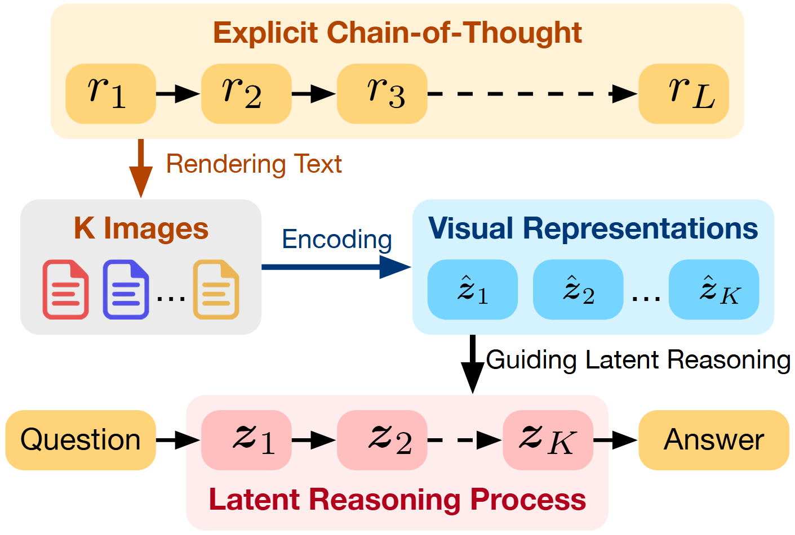
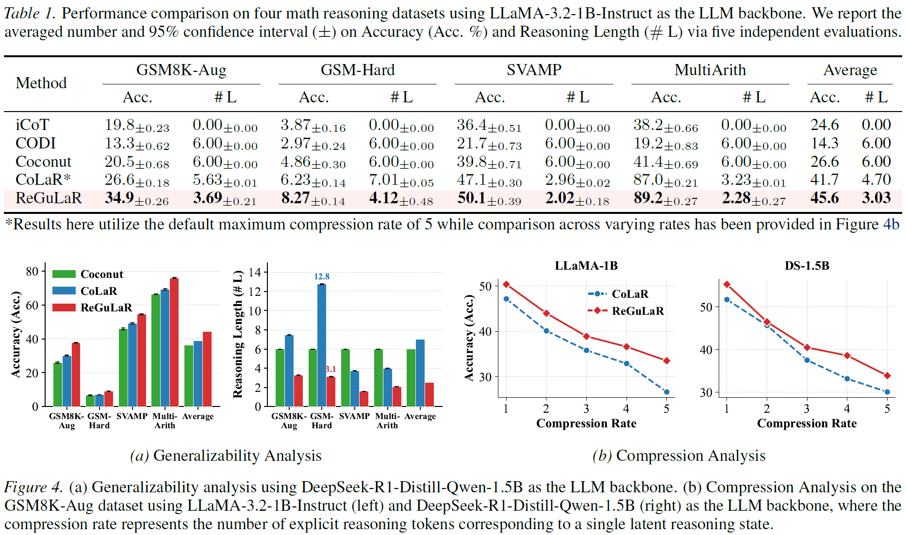
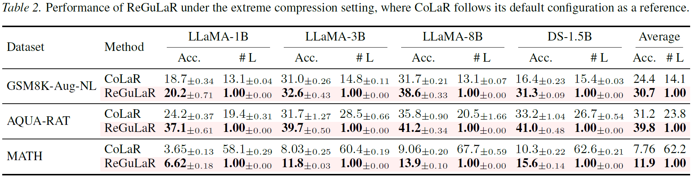
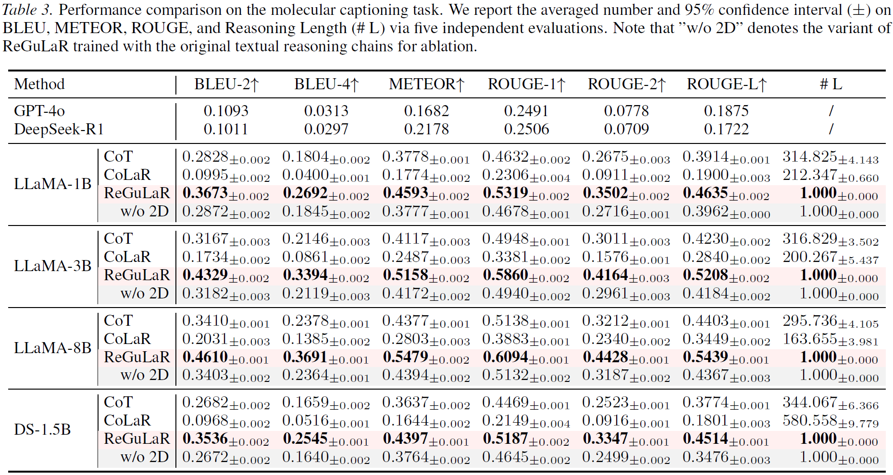

<div align=center>

# ReGuLaR: Variational Latent Reasoning Guided by Rendered Chain-of-Thought

[](https://arxiv.org/abs/2601.23184)
[](https://github.com/FanmengWang/ReGuLaR)
[](https://huggingface.co/FanmengWang/ReGuLaR)
[](LICENSE)

</div>

This is the official implementation of our paper “ReGuLaR: Variational Latent Reasoning Guided by Rendered Chain-of-Thought”.

<p align="center" style="margin-top: 20px;">
  
</p>


## 🔥 News
* `2026/01/30` 💥 We release our [paper](https://arxiv.org/abs/2601.23184) and [code](https://github.com/FanmengWang/ReGuLaR).


## 📖 Introduction
While Chain-of-Thought (CoT) significantly enhances the performance of Large Language Models (LLMs), explicit reasoning chains introduce substantial computational redundancy. 
Recent latent reasoning methods attempt to mitigate this by compressing reasoning processes into latent space, but often suffer from severe performance degradation due to the lack of appropriate compression guidance.
In this study, we propose **Re**ndered CoT-**Gu**ided variational **La**tent **R**easoning (**ReGuLaR**), a simple yet novel latent learning paradigm resolving this issue.
Fundamentally, we formulate latent reasoning within the Variational Auto-Encoding (VAE) framework, sampling the current latent reasoning state from the posterior distribution conditioned on previous ones.
Specifically, when learning this variational latent reasoning model, we render explicit reasoning chains as images, from which we extract dense visual-semantic representations to regularize the posterior distribution, thereby achieving efficient compression with minimal information loss.
Extensive experiments demonstrate that ReGuLaR significantly outperforms existing latent reasoning methods across both computational efficiency and reasoning effectiveness, and even surpasses CoT through multi-modal reasoning, providing a new and insightful solution to latent reasoning.

**Note: the LLM trained by ReGuLaR still follows the standard latent reasoning paradigm, accepting pure text inputs and imposing no extra computational cost during inference.**

## ✨ Key Highlights

* **SOTA Performance**: ReGuLaR significantly outperforms existing latent reasoning methods, achieving state-of-the-art performance with minimal reasoning length.

<p align="center" style="margin-top: 20px;">
  
</p>

* **Extreme Compression**: Even when compressing all reasoning information into one latent reasoning state, ReGuLaR maintains superior performance across all model scales and datasets.

<p align="center" style="margin-top: 20px;">
  
</p>

* **Multi-Modal Reasoning**: By rendering non-textual elements alongside text, ReGuLaR natively supports multi-modality within its latent reasoning processes, enabling it to surpass explicit CoT in complicated reasoning scenarios.

<p align="center" style="margin-top: 20px;">
  
</p>


## ⚒️ Dependencies
We have provided an `env.yml` file that contains the necessary environment dependencies. 
To set up your environment, please execute:
``` bash
conda env create -f env.yml
conda activate ReGuLaR
```


## 📦 Model Preparation
Please download required models from [HuggingFace](https://huggingface.co) using the following script:
``` bash
cd models
python model_download.py <YOUR_ACCESS_TOKEN>
```


## 💪 Experiments
### Datasets 
ReGuLaR is designed to be compatible with any reasoning dataset as long as each data sample within the dataset is formatted as the following JSON schema:
```json
{
  "image_idx": "Unique identifier for subsequent rendering",
  "question": "Problem statement",
  "steps": "Reasoning chain",
  "answer": "Final answer"
}
```
For reference, the GSM8K-Aug dataset has been provided in the `./datasets` folder, please unzip it before use.

### Pre-computation
Since the rendering function is predefined and the visual encoder remains frozen in our work, we pre-compute visual representations offline before training, thereby reducing computational overhead.
``` bash
cd data_precessing
python image_render.py GSM8K-Aug
python representation_extract.py GSM8K-Aug
```

### Training
``` bash
bash train.sh GSM8K-Aug
```

### Evaluation
``` bash
python run.py \
  --test_ckpt_path=/path/to/trained/model.ckpt \
  dataset_name=GSM8K-Aug
```


## 👍 Acknowledgments
We extend our sincere gratitude to [CoLaR](https://github.com/xiaomi-research/colar), [DeepSeek-OCR](https://github.com/deepseek-ai/DeepSeek-OCR) and [Glyph](https://github.com/thu-coai/Glyph) for their great work and codebase, which served as the foundation for developing ReGuLaR.


## 📌 Citation
If you find ReGuLaR useful in your research, please consider citing it. 😊
```bibtex
@article{Wang2026ReGuLaR,
  title={ReGuLaR: Variational Latent Reasoning Guided by Rendered Chain-of-Thought},
  author={Wang, Fanmeng and Liu, Haotian and Zhao, Guojiang and Xu, Hongteng and Gao, Zhifeng},
  journal={arXiv preprint arXiv:2601.23184},
  year={2026}
}
```